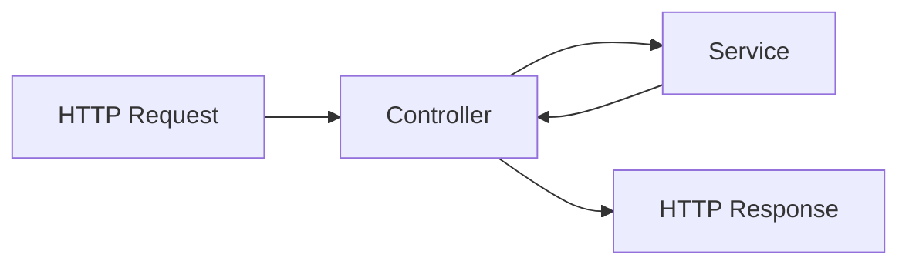

<p align="center"><a href="https://laravel.com" target="_blank"></a></p>

## Laravel API com Integração ao Gateway de Pagamento Asaas
Este é um projeto Laravel que integra a API do Asaas para gerenciamento de cobranças via Pix, boleto e cartão de crédito.


## Requisitos

- PHP ≥ 8.3
- Composer
- Laravel 12
- Banco de dados MySQL

## Instalação

1. Clone o repositório:
   ```sh
   git clone https://github.com/JosePedro-22/TestIntegracaoAsaas.git
   cd TestIntegracaoAsaas
   ```

2. Instale as dependências:
   ```sh
   composer install
   ```

3. Configure o arquivo `.env`:
   ```sh
   cp .env.example .env
   ```
   Atualize as credenciais do banco de dados e a chave da API do Asaas.

4. Gere a chave da aplicação:
   ```sh
   php artisan key:generate
   ```

5. Execute as migrações:
   ```sh
   php artisan migrate
   ```

6. Inicie o servidor:
   ```sh
   php artisan serve
   ```

## Rotas da API

### Criar Usuário
```http
GET http://127.0.0.1:8000/api/user/create
```

### Login do Usuário
```http
GET http://127.0.0.1:8000/api/login
```

### Obter Dados do Usuário Logado
```http
GET http://127.0.0.1:8000/api/user
Headers: Authorization: Bearer {token}
```

### Criar um Cliente no Asaas
```http
POST http://127.0.0.1:8000/api/customers
Headers: Authorization: Bearer {token}
```
**Body:**
```json
{
  "name": "Jonas Cavalcanti",
  "cpfCnpj": "84265174000176",
  "email": "cliente@email.com",
  "phone": "123456789",
  "mobilePhone": "987654321",
  "address": "Rua Exemplo",
  "addressNumber": "123",
  "complement": "Apto 101",
  "province": "Bairro Exemplo",
  "postalCode": "12345000",
  "externalReference": "ID12345",
  "notificationDisabled": false,
  "additionalEmails": "email1@email.com,email2@email.com",
  "municipalInscription": "1234567890",
  "stateInscription": "12345678",
  "observations": "Observação do cliente",
  "groupName": "Grupo A",
  "company": "Empresa Exemplo",
  "foreignCustomer": false
}
```

### Criar uma Cobrança
```http
POST http://127.0.0.1:8000/api/payments
Headers: Authorization: Bearer {token}
```
**Body:**
```json
{
  "customer": "cus_XXXXXXXXXX",
  "billingType": "PIX",
  "value": 100.90,
  "dueDate": "2025-03-20",
  "description": "Pagamento via Asaas"
}
```

### Listar Cobranças de um Cliente
```http
GET http://127.0.0.1:8000/api/payments/customer/{customerId}
Headers: Authorization: Bearer {token}
```

### Cancelar uma Cobrança
```http
DELETE http://127.0.0.1:8000/api/payments/{id}
Headers: Authorization: Bearer {token}
```

### Obter QR Code PIX de um Pagamento
```http
GET http://127.0.0.1:8000/api/payments/{id}/pix
Headers: Authorization: Bearer {token}
```

## 💬 comentários sobre o projeto:
#### Diagramas do caminho da solicitação à resposta

## Contribuição

Contribuições são bem-vindas! Para contribuir:
1. Fork o repositório
2. Crie uma branch: `git checkout -b minha-feature`
3. Commit suas mudanças: `git commit -m 'Adicionando nova feature'`
4. Envie seu código: `git push origin minha-feature`
5. Abra um Pull Request
